# Keyboard-Joystick

Inspired by [MaxxStick](https://maxxstick.com/) and [Gaming Mod Kits](https://www.gamingmodkits.com/product/keyboardjoystick/2) keyboard-joystick controllers, I recreated the general proportions and geometry in Onshape.

## Used
- CAD: [Onshape](https://www.onshape.com/en/)
- Slicer: [OrcaSlicer](https://www.orcaslicer.com/)
- 3D Printer: [Qidi Plus 4](https://us.qidi3d.com/)

##
### Wooting 60 HE Mod

Designed an attachment for the Wooting 60HE that adds a stable handhold during joystick use.

## Versions

### Version 1

### Version 2: GMK Joystick Inspired Design with Wooting 60HE Mod

<table>
  <colgroup>
    <col width="16.66%">
    <col width="16.66%">
    <col width="16.66%">
    <col width="16.66%">
    <col width="16.66%">
    <col width="16.66%">
  </colgroup>

  <tr>
    <td align="center" colspan="2">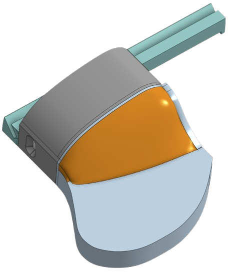</td>
    <td align="center" colspan="2">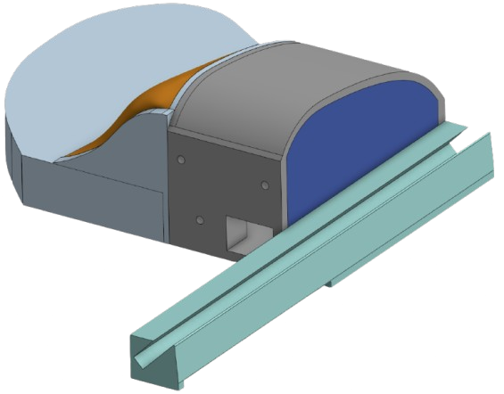</td>
    <td align="center" colspan="2">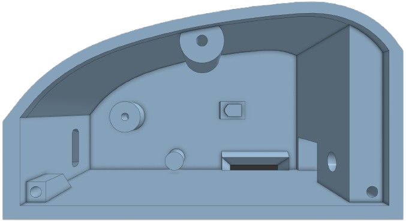</td>
  </tr>
  <tr>
    <td align="center" colspan="2">Isometric (Front)</td>
    <td align="center" colspan="2">Isometric (Rear)</td>
    <td align="center" colspan="2">Interior</td>
  </tr>

  <tr>
    <td align="center" colspan="3">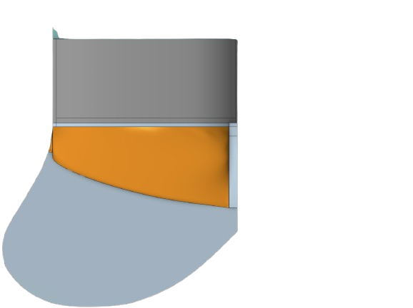</td>
    <td align="center" colspan="3">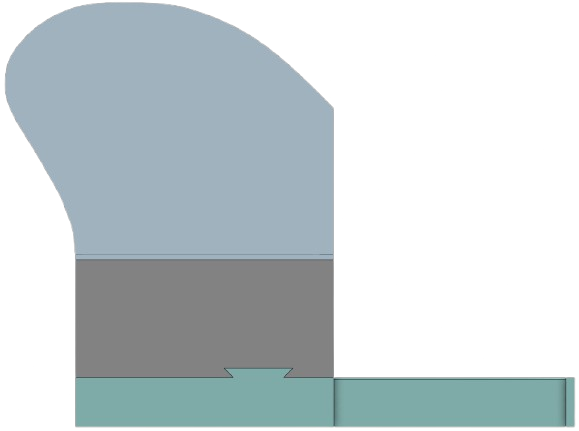</td>
  </tr>
  <tr>
    <td align="center" colspan="3">Top</td>
    <td align="center" colspan="3">Bottom</td>
  </tr>

  <tr>
    <td align="center" colspan="3">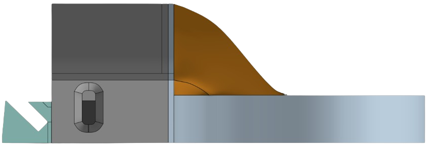</td>
    <td align="center" colspan="3">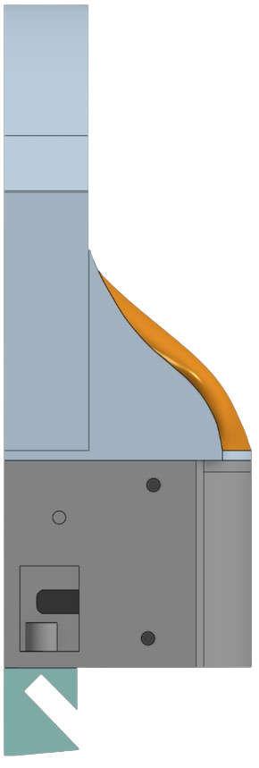</td>
  </tr>
  <tr>
    <td align="center" colspan="3">Left</td>
    <td align="center" colspan="3">Right</td>
  </tr>
</table>

### Version 3: MaxxStick-Inspired Design with Wooting 60HE Mod
- Built over 6 days (~120 hours total) across CAD iteration, print tests, and assembly/tolerance adjustments.

<table>
  <tr>
    <td align="center" width="33%">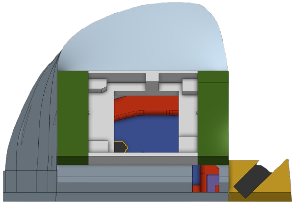</td>
    <td align="center" width="33%">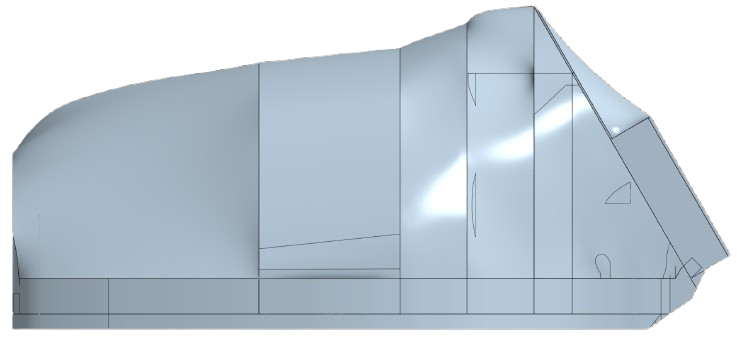</td>
    <td align="center" width="33%">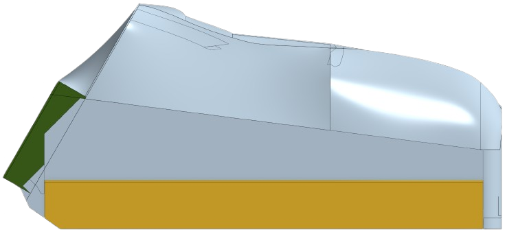</td>
  </tr>
  <tr>
    <td align="center">Front</td>
    <td align="center">Left</td>
    <td align="center">Right</td>
  </tr>

  <tr>
    <td align="center" width="33%">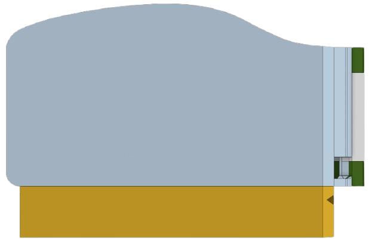</td>
    <td align="center" width="33%">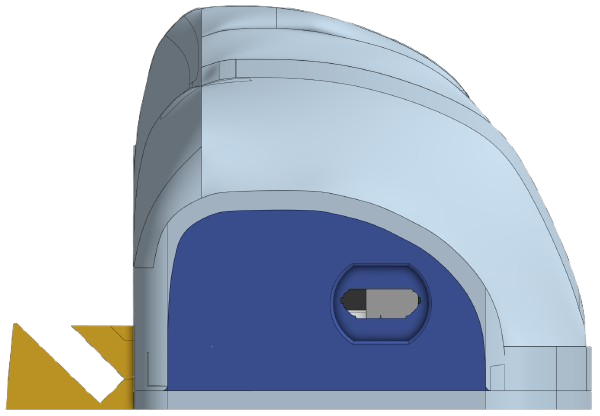</td>
    <td align="center" width="33%"></td>
  </tr>
  <tr>
    <td align="center">Bottom</td>
    <td align="center">Rear</td>
    <td align="center">Isometric (Front)</td>
  </tr>

  <tr>
    <td align="center" width="33%"></td>
    <td align="center" width="33%"></td>
    <td align="center" width="33%">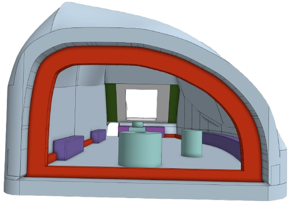</td>
  </tr>
  <tr>
    <td align="center">Isometric (Left)</td>
    <td align="center">Isometric (Right)</td>
    <td align="center">Interior</td>
  </tr>
</table>

## Copyright & Licensing

Copyright © Talha Akhlaq

Distributed under the MIT License. See LICENSE for details.
##

For more information on my projects and coursework, please see my [repositories](https://github.com/TalhaAkhlaq?tab=repositories).
