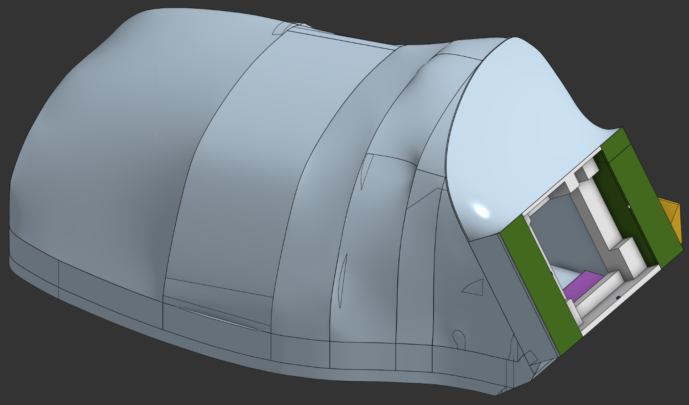
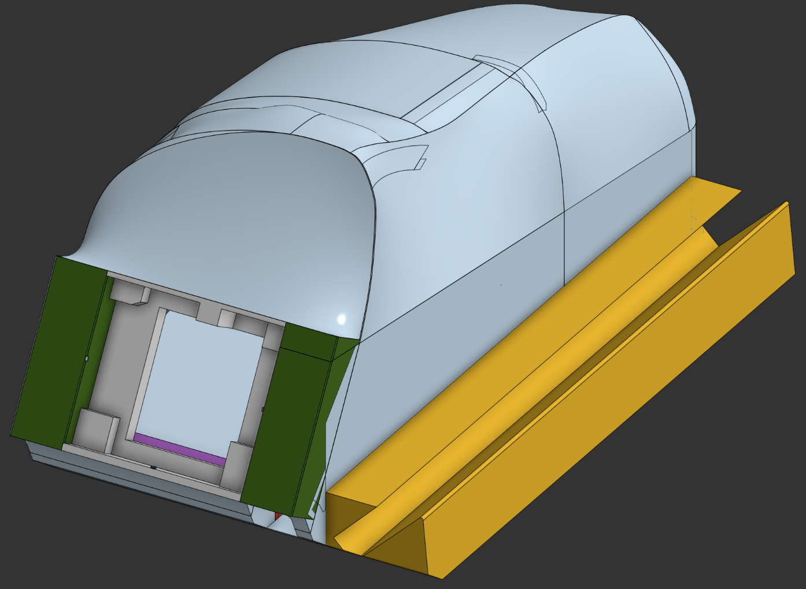
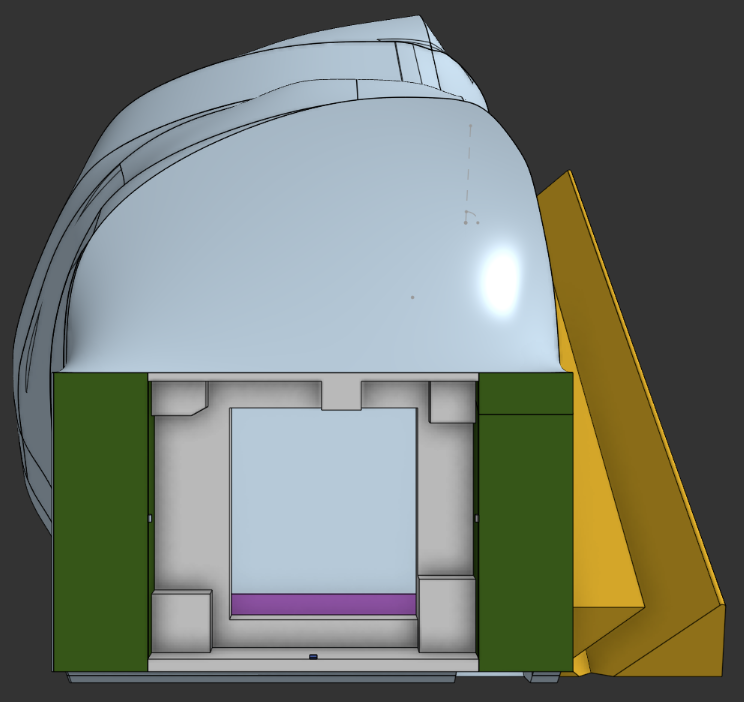

# Keyboard-Joystick

Inspired by [MaxxStick](https://maxxstick.com/) and [Gaming Mod Kits](https://www.gamingmodkits.com/product/keyboardjoystick/2) keyboard-joystick controllers, I recreated the general proportions and geometry in Onshape.

## Used
- CAD: [Onshape](https://www.onshape.com/en/)
- Slicer: [OrcaSlicer](https://www.orcaslicer.com/)
- 3D Printer: [Qidi Plus 4](https://us.qidi3d.com/)

## Wooting 60 HE Mod

Designed a clamp-on grip for the Wooting 60HE to add a stable handhold during joystick use.

## Versions

### Version 1
- <add notes and images here>

### Version 2
- <add notes and images here>

### Version 3 MaxxStick + Wooting 60HE Mod
- Built over 6 days (~120 hours total) across CAD iteration, print tests, and fit fixes.

| | |
|---|---|
|  Left side view |  Top view |
|  Right side view |  End view |
|  End section (cutaway) |  Isometric view |
|  Isometric section (cutaway) |  End section view |
